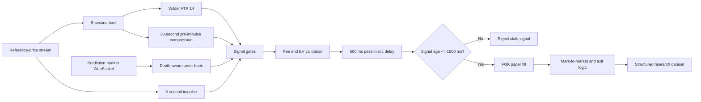

# Prediction-Market Microstructure Research

Portfolio case study of a low-latency research system for short-horizon binary
prediction markets.

> This repository intentionally contains no production source code,
> credentials, infrastructure addresses, trading endpoints, or live dashboard
> links. It documents engineering decisions, experimental methodology, and
> lessons learned.

## Project summary

The project explores whether a fast external reference-price move can be used
to detect temporarily stale quotes in a five-minute binary market.

The system was designed as a research and paper-trading platform rather than a
claim of guaranteed profitability. Its core responsibilities include:

- continuous WebSocket order-book ingestion;
- depth-aware fill simulation;
- fee-aware expected-value calculations;
- Chainlink reference-price ingestion;
- Wilder ATR calculated from continuous five-second bars;
- latency-aware FOK paper execution;
- live observability, structured logs, and reproducible analysis;
- automatic rotation between consecutive five-minute markets.

## What I built

- A Rust event-driven recorder and strategy engine.
- A real-time monitoring dashboard.
- A continuous market-data and decision audit trail.
- A pessimistic paper-execution model with configurable latency and slippage.
- Position-level PnL accounting, including full loss on incorrect resolution.
- Post-trade analysis grouped by direction, entry price, model confidence,
  impulse size, edge, and time remaining.
- Operational deployment on a hardened Linux service with restart supervision,
  memory limits, and disk-retention controls.

## Decision pipeline

## Current research gates

The revised model requires:

- a 30-second compression range of at most `2.5 × ATR`;
- a directional five-second impulse of at least `1.5 × ATR`;
- market price between `0.40` and `0.60`;
- model probability of at least `0.60`;
- edge after fees of at least `0.075`;
- sufficient visible depth for the complete simulated fill;
- positive expected value after fees;
- signal age no greater than `1500 ms`.

These thresholds are research parameters, not financial recommendations.

## Evidence-driven iteration

An initial sample of 125 closed paper positions was intentionally evaluated
before changing the model. The analysis found that weak-edge and higher-priced
entries were responsible for most of the drawdown. The revised model therefore
adds stricter edge and price filters, a stale-signal TTL, and a dedicated
pre-impulse compression indicator.

See:

- [Architecture](docs/ARCHITECTURE.md)
- [Methodology](docs/METHODOLOGY.md)
- [Research results](docs/RESULTS.md)
- [Security and disclosure policy](docs/SECURITY.md)
- [Sanitized decision-record example](samples/decision-record.example.json)

## Skills demonstrated

`Rust` · `Tokio` · `WebSockets` · `event-driven systems` · `order-book
microstructure` · `time-series analysis` · `paper trading` · `observability` ·
`data validation` · `Linux/systemd` · `post-trade analytics`

## Important limitation

Historical performance from a small in-sample dataset does not establish
future profitability. Official market resolution, out-of-sample testing, and
walk-forward evaluation are required before drawing stronger conclusions.

# prediction-market-microstructure-research
Portfolio case study: low-latency market data, volatility modelling, paper execution and post-trade analytics in Rust.
